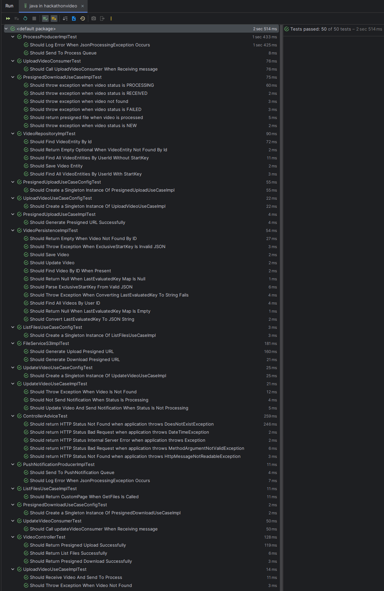
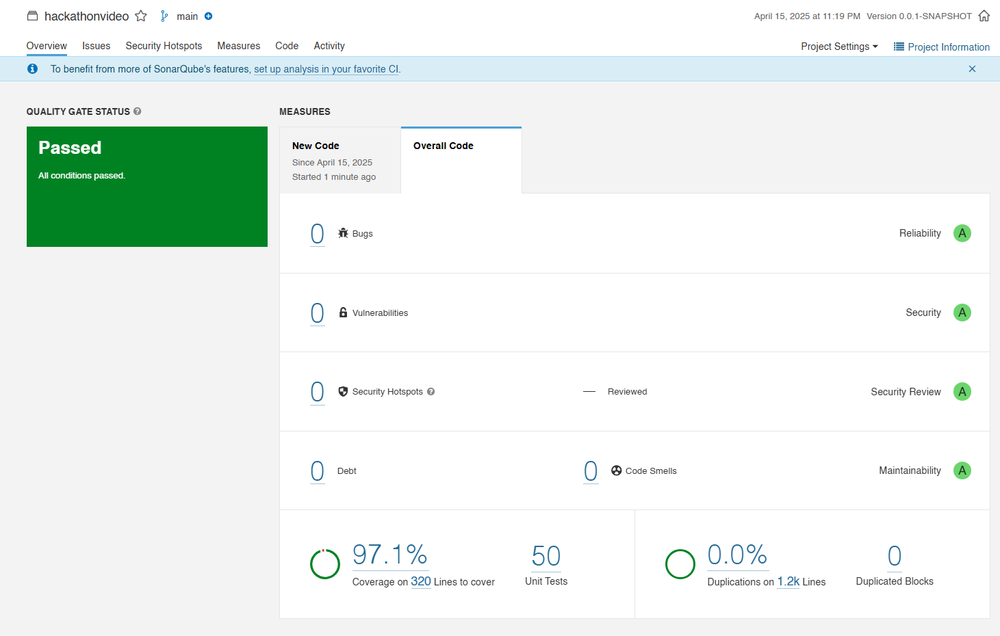
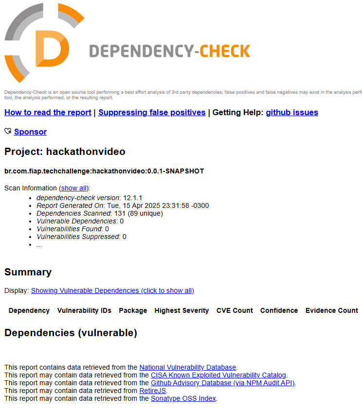
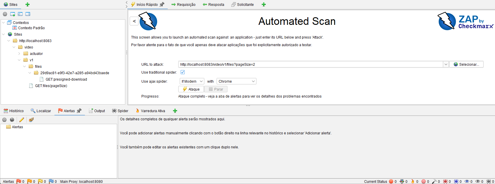

<div align="center">

# FIAP Hackathon - Video API (Orquestrador)


<br>

</div>

## 💻 Descrição

Este projeto atua como um orquestrador na arquitetura de microserviços da Hackathon Video e também fornece uma API para a comunicação com o front-end.

## 🛠 Tecnologias Utilizadas


## 💫 Arquitetura

O projeto adota a **Clean Architecture**, garantindo flexibilidade, testabilidade e manutenção escalável.

## ⚙️ Configuração

### Pré-requisitos

### Desenvolvimento

- **[Java 21](https://docs.oracle.com/en/java/javase/21/)**: Documentação oficial do Java 21.
- **[Maven 3.6.3+](https://maven.apache.org/)**: Site oficial do Maven.
- **[Docker](https://www.docker.com/)**: Site oficial do Docker.
- **[Docker Compose](https://docs.docker.com/compose/)**: Documentação oficial do Docker Compose.
- **[Sonarqube](https://www.sonarsource.com/products/sonarqube/)**: Site oficial do Sonarqube.
- **[Kubernetes](https://kubernetes.io/pt-br/docs/home/)**: Documentação oficial do Kubernetes.
- **[Terraform](https://www.terraform.io/)**: Site oficial do Terraform.
- **[AWS](https://aws.amazon.com/pt/)**: Site oficial da AWS.

### 🚀 Execução

### Subindo a aplicação com Docker Compose

1. Executar o comando:

```sh
docker compose up
```

### Subindo o MS Video com Terraform
Caso deseje subir a MS Video com o Terraform, basta seguir os seguintes passos:

1. Certificar que o Terraform esteja instalado executando o comando `terraform --version`;
2. Certificar que o `aws cli` está instalado e configurado com as credenciais da sua conta AWS;
3. Acessar a pasta `terraform` que contém os arquivos que irão criar o MS Video;
4. Inicializar o Terraform no projeto `terraform init`;
5. Verificar que o script do Terraform é valido rodando o comando `terraform validate`;
6. Executar o comando `terraform plan` para executar o planejamento da execução/implementação;
7. Executar o comando `terraform apply` para criar o MS Video;
8. Após a execução do Terraform finalizar, verificar se o Video subiu corretamente na AWS;

## ✅ Cobertura de Testes

### Testes Unitarios


### Scan do Sonar


### Verificação de vulnerabilidades com Check Dependency OWASP


### Teste OWASP ZAP para verificação de vulnerabilidade nas APIs


## 🎲 Seeds

Este projeto utiliza **seeds** para criar a tabela e configurar as filas de forma local usando o localstack foi utilizado um arquivo bash.
```bash
.bash/create_local_resources.sh
```